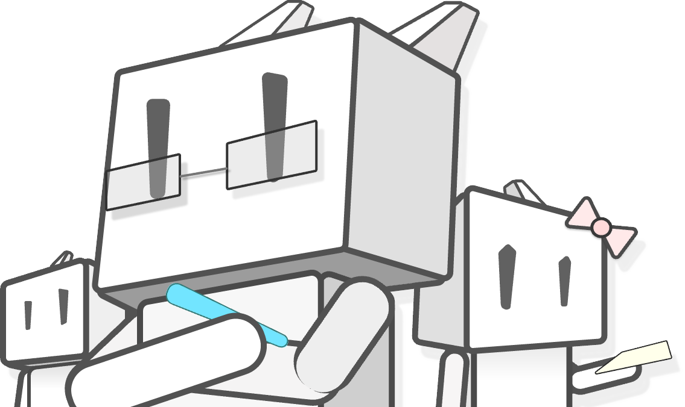

<h1 align="center">&nbsp;Robo&nbsp;Logic&nbsp;</h1>

<h4 align="center">📺Robo.T&emsp;|&emsp;🎓College Student&emsp;|&emsp; ⭐GuiZhou-China</h4>

 

***

#### &emsp;嗨各位好😀！我是📺Robo.Timaviciix[昵称]📺,截至目前（2024年），我仍然是一名贵州在校大学生；我就读与本大学的计算机与信息学院，软件工程专业。我一直认为只有开源才能够加速人类进步；因此我希望也在这条路上贡献出自己的一份力量！

#### &emsp;Hi there😀,I'm 📺Robo.Timaviciix[NickName]📺;As of today (2024), I am still a university student in Guizhou; I am studying in the School of Computer Science and Information Technology at my university, majoring in Software Engineering.I have always believed that only open source can accelerate the progress of mankind; Therefore, I hope to contribute to this path!

#### 2024.5.12 Robo.Timaviciix

#### 与我交流吧! Try contacting me!

***

### 我已学习的编程语言[Programming Languages Learned]: 
系统编程类语言🖥[Systems Programming Languages]: 
&emsp;
&emsp;
&emsp;
&emsp;
&emsp;
 

Web开发类语言🌏[Web Development Languages]: 
&emsp;
&emsp;
&emsp;
&emsp;
&emsp;
 

移动开发类语言📱[Mobile Development Languages]: 
&emsp;
&emsp;
 

项目管理类语言🔍[Project Management Languages]: 
&emsp;
 

编程,存储与管理框架💾[Programming ,Storage and Management Frameworks]: 
&emsp;
&emsp;
&emsp;
 
&emsp;
&emsp;
&emsp;
 
&emsp;
&emsp;
&emsp;
 
&emsp;
&emsp;
 
&emsp;
&emsp;
 

建模与游戏引擎🎮[Modeling Software and Game Engines]: 
&emsp;
&emsp;
 
&emsp;
&emsp;

***

***

<h3><b>Robo开源项目的企划 Robo Open Source Plan</b></h3>

#### &emsp;自从2021年我接触计算机与编程开始,我就在无偿使用各个编程领域的开源软件及构件;当我逐渐了解了开源对人类的重要意义后,我花了许多时间去学习各种知识。我希望能够在人类对于计算机思想的共享计划上做出一份自己的贡献!  &emsp;Since my introduction to computers and programming in 2021, I have been using open source software and components in various programming areas for free; I have spent a lot of time learning about open source as I have come to understand its significance to mankind. I hope to make a contribution to the human computer idea sharing program!  &emsp;过一段时间后,我将开始采用Kotlin进行Android共享构件AAR的制作,我希望我的构件能够缩短Android移动软件的开发过程!  &emsp;After a while, I will start to use Kotlin for Android shared artifacts AAR, I hope my artifacts can shorten the process of Android mobile software development!  2024 Robo.Timaviciix

***

<b>承诺 Commitment</b>

•

<b>勇气 Courage</b>

•

<b>专注 Focus</b>

•

<b>开放 Openness</b>

•

<b>尊重 Respect</b>

•

<b>主动 Initiative</b>

